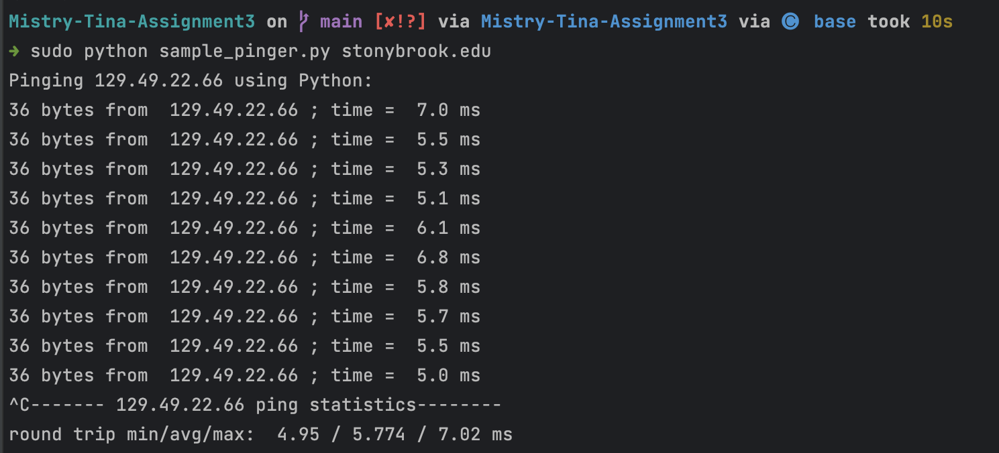

# CSE-310-Pinger
**I changed the source code to print "request timeout" instead of returning it.
To run my project I used the command: sudo python sample_pinger.py <destination>

First I tested my client by sending packets to local host: 127.0.0.1
Which can be seen in the screenshot 

Next I tested by sending packet to stonybrook.edu
Which can be seen in the screenshot 

Then the three root servers I used were:
1) WIDE, Project, Tokyo

2) RIPE, London

3)Autonomica, Stockholm, Sweden

Conclusion: The round trip times for the destinations that were physically closest to me, like stonybrook.edu 
and local host were a lot less than the root servers outside the U.S. I think that the destinations closest to me required 
less hops to get to which results in a lower RTT